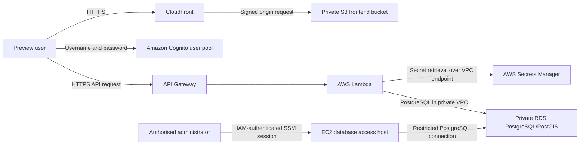

# Habitune Security Plan

## Document control

| Item | Details |
|---|---|
| Document title | Habitune Security Plan |
| Project | Habitune |
| Version | V0.1 |
| Current iteration | Iteration 1 |
| Document status | Living security document |
| Last updated | 3 September 2026 |
| Prepared for | Habitune project team |
| Platforms | React web application and Python serverless backend on AWS |
| Primary focus | Preview access control, API security, cloud infrastructure, database security, data integrity and operational readiness |

### Version history

| Version | Date | Changes |
|---|---|---|
| V0.1 | 3 September 2026 | Initial security plan based on the deployed Iteration 1 application, source review and current validation evidence. |

---

## 1. Executive summary

Habitune Iteration 1 is a web application that helps users explore urban biodiversity indicators for selected Melbourne precincts. It uses a React frontend, Amazon Cognito for preview login, Amazon CloudFront and a private Amazon S3 origin for hosting, Amazon API Gateway, Python 3.12 AWS Lambda functions, and a private PostgreSQL/PostGIS database on Amazon RDS. Infrastructure is defined with AWS SAM and CloudFormation.

The application already includes several sound security controls. The RDS instance is not publicly accessible; database and Lambda workloads are separated with security groups and private subnets; the RDS master password is generated and stored by AWS Secrets Manager; S3 public access is blocked; CloudFront uses origin access control; HTTPS is enforced for frontend traffic; database storage and frontend objects are encrypted at rest; SQL parameters are used for precinct lookup; API errors are sanitised; CloudWatch log retention is defined; and database administration is performed through an IAM-authorised Systems Manager tunnel without inbound SSH.

The present implementation is suitable for a controlled Iteration 1 demonstration, but it should not yet be treated as production-ready. The most important gap is that Cognito currently protects only the React user interface. The API Gateway endpoints do not use a Cognito authorizer and can be called directly without signing in. In addition, read-only Lambda functions retrieve the RDS master credential, CORS falls back to all origins, automated RDS backups are disabled, the database initializer remains deployed, MFA is disabled, and monitoring and abuse protection are limited.

The recommended Iteration 2 priority is to enforce Cognito at API Gateway, create a dedicated read-only database user and secret, restrict CORS, remove or isolate the initializer, enable short automated backup retention, introduce individual administrative identities with MFA, and add security headers, API logging, alarms and throttling. These changes are comparatively contained and can materially improve the security posture without redesigning the application.

---

## 2. Purpose, scope and assumptions

### 2.1 Purpose

This document records the security posture that actually exists at the end of Iteration 1. It separates implemented controls from partial controls and future work so that planned features are not represented as completed security.

### 2.2 In scope

- React/Vite frontend and browser authentication flow.
- Amazon Cognito user pool and application client.
- CloudFront and private S3 frontend hosting.
- API Gateway and Lambda precinct/health endpoints.
- PostgreSQL/PostGIS on Amazon RDS.
- Secrets Manager integration and Lambda database access.
- VPC, subnet, route and security-group boundaries.
- Systems Manager database-access tunnel.
- Dataset ingestion, validation and database initialization.
- Source-control secret hygiene, dependency posture and error handling.
- CloudFormation/SAM deployment configuration.

### 2.3 Out of scope for V0.1

- A full independent penetration test.
- Formal compliance certification or legal opinion.
- Production load, denial-of-service or disaster-recovery testing.
- Security controls for features not implemented in Iteration 1.
- End-user personal accounts, roles, payments or stored personal profiles.
- Pollination-corridor functionality that is explicitly deferred.

### 2.4 Key assumptions

- Habitune remains a controlled Iteration 1 preview rather than a public production service.
- Biodiversity data is predominantly public or council/open-data-derived and is not classified as confidential personal data.
- A searched street, address or coordinate can still be privacy-relevant while it is being processed, even when Habitune does not persist it.
- AWS account, domain and credential values are intentionally excluded from this document.

---

## 3. System overview

### 3.1 Architecture

### 3.2 Main components

| Component | Purpose | Security relevance |
|---|---|---|
| React/Vite frontend | Presents landing, area selection and ecosystem views | Processes user input, tokens and API responses in the browser |
| Cognito user pool | Restricts access to the preview interface | Password policy and authentication boundary |
| CloudFront | Delivers the frontend over HTTPS | TLS termination, caching and future response-header enforcement |
| Private S3 bucket | Stores compiled frontend assets | Origin confidentiality and deployment artifact integrity |
| API Gateway | Exposes health and precinct APIs | Primary missing server-side authentication and abuse-control boundary |
| Lambda functions | Handles API requests, database initialization and response shaping | IAM permissions, input handling, secrets access and logging |
| Secrets Manager | Stores the RDS-managed master credential | Prevents credentials from being committed or embedded in templates |
| RDS PostgreSQL/PostGIS | Stores precinct boundaries and biodiversity metrics | Primary integrity and availability asset |
| VPC and security groups | Isolates database and application traffic | Limits reachable ports and permitted component relationships |
| SSM access host | Provides temporary administrative database connectivity | Removes need for public RDS or inbound SSH; requires strict IAM governance |
| Dataset pipeline | Cleans, validates and prepares source datasets | Protects the meaning and integrity of displayed biodiversity indicators |

### 3.3 Trust boundaries

| Boundary | Principal threats | Current treatment |
|---|---|---|
| Browser to Cognito | Credential guessing, account sharing, token theft | Strong password policy, SRP authentication, admin-created users, token revocation; MFA remains off |
| Browser to API Gateway | Direct unauthorised use, request tampering, automated scraping | HTTPS and parameterised database lookup; API authorization and throttling remain incomplete |
| CloudFront to S3 | Direct bucket access or origin bypass | S3 public access block and CloudFront origin access control |
| Lambda to Secrets Manager | Secret disclosure or overly broad access | Secret ARN imported from the core stack and role access scoped to that secret |
| Lambda to RDS | SQL injection, excessive privilege, network traversal | Private networking, security-group allowlisting and parameterised queries; Lambdas still use the master database account |
| Administrator to RDS | Credential misuse or unmanaged network access | IAM-authenticated SSM tunnel, no inbound host ports and IMDSv2; administrator IAM scope is currently too broad |
| Dataset to database | Malformed, inconsistent or misleading records | Contract validation, database constraints, transaction rollback and post-ingestion verification |
| External map/location service | Third-party availability and location-query disclosure | Requests are limited to search functionality; privacy notice and provider governance remain future work |

---

## 4. Security objectives

| Objective | Iteration 1 interpretation | Current status |
|---|---|---|
| Confidentiality | Keep credentials and cloud internals out of source and prevent public database access | Partially achieved |
| Integrity | Prevent unsafe SQL handling and reject inconsistent biodiversity data | Strong foundation |
| Availability | Keep the preview recoverable and observable | Limited by disabled backups, Single-AZ database and minimal alerting |
| Authentication | Restrict the Iteration 1 preview to approved users | Partially achieved at the UI; not enforced at the API |
| Authorization | Give each workload and operator only the access required | Partially achieved in IAM/networking; database and human privileges remain broad |
| Accountability | Retain sufficient logs to investigate faults and access | Basic Lambda logs exist; API/access/security audit coverage is incomplete |
| Privacy | Avoid unnecessary collection or retention of user location data | No persistent user profile is implemented; third-party search disclosure needs documentation |
| Transparency | Represent biodiversity indicators and limitations accurately | Improved through qualified, dataset-supported frontend wording |

---

## 5. Data classification and handling

| Data category | Examples | Classification | Storage/processing |
|---|---|---|---|
| Public environmental data | Canopy polygons, council tree/garden inventory, filtered species records | Public/low confidentiality; medium integrity | Dataset artifacts, RDS and API responses |
| Derived biodiversity indicators | Canopy percentage, density values and provisional 0–100 indicator | Low confidentiality; high integrity and interpretation importance | Calculated by the dataset pipeline and stored in RDS |
| Precinct geometry | MultiPolygon boundaries and area identifiers | Public/low confidentiality; medium integrity | PostGIS and GeoJSON API |
| Authentication data | Cognito username, password verifier and tokens | High confidentiality | Managed by Cognito and the authenticated browser session |
| Database credentials | RDS master username/password | Critical confidentiality | RDS-managed Secrets Manager secret; retrieved by authorised Lambdas |
| Search/location input | Suburb, street, address or coordinate entered by a user | Potentially privacy-relevant | Temporarily processed in the browser and external search flow; not designed for Habitune persistence |
| Operational logs | Lambda exceptions and execution metadata | Internal | CloudWatch Logs with configured retention |
| Deployment configuration | Stack parameters, pool IDs, API base URL and resource identifiers | Internal/public identifiers, not credentials | SAM configuration, environment configuration and CloudFormation outputs |

### 5.1 Data integrity controls

- Database tables enforce non-null, range, uniqueness, foreign-key and geometry-validity constraints.
- Geometry is normalised to PostGIS `MultiPolygon` with SRID 4326.
- Dataset ingestion validates required records before database access.
- Schema execution, ingestion and verification run in one transaction with rollback on failure.
- The initializer verifies expected row counts, relationships, score ranges and geometry state before committing.
- The frontend now describes the 0–100 value as a provisional relative indicator rather than a complete biodiversity assessment.

### 5.2 Data interpretation limitation

Species values are inventory/occurrence-derived indicators, not population counts or confirmed habitat measurements. The biodiversity indicator is the mean of min-max-scaled canopy, plant-density and animal-density components across the current ten precincts. Security and integrity reviews must treat misleading presentation as a data-integrity risk, even if the underlying numeric value is technically correct.

---

## 6. Implemented security controls

### 6.1 Identity and preview access

- Cognito username/password authentication is implemented in the frontend.
- Self-service sign-up is disabled; users must be created administratively.
- Usernames are case-insensitive.
- Passwords require at least 12 characters with uppercase, lowercase, number and symbol requirements.
- Cognito user-existence errors are suppressed.
- User SRP authentication is enabled rather than transmitting a reusable password directly to Habitune infrastructure.
- Access and ID tokens expire after one hour; refresh tokens expire after one day.
- Token revocation is enabled.

Status: **Partial**. This protects normal UI navigation but is not yet an API authorization control.

### 6.2 Frontend hosting

- S3 Block Public Access is fully enabled.
- CloudFront accesses S3 through a signed origin access control policy.
- The bucket policy permits read access only from the designated CloudFront distribution.
- S3 objects are encrypted with SSE-S3 (`AES256`).
- CloudFront redirects HTTP viewers to HTTPS.
- Modern HTTP/2 and HTTP/3 delivery is enabled.
- S3 and Cognito resources use retention policies to reduce accidental deletion during stack replacement/removal.

### 6.3 Network and database protection

- RDS is configured with `PubliclyAccessible: false`.
- Application and database subnets do not automatically assign public IP addresses.
- Database ingress is limited to the Lambda security group and the dedicated SSM database-access security group on the configured PostgreSQL port.
- Lambda egress is explicitly limited to PostgreSQL and the Secrets Manager VPC endpoint.
- Database and endpoint security groups do not use default unrestricted egress.
- RDS storage encryption is enabled.
- RDS deletion protection is enabled in dev.
- CloudFormation uses snapshot policies when RDS is deleted or replaced.
- Automatic minor-version upgrades are enabled.
- No database password is embedded in code, `samconfig.toml` or CloudFormation.

### 6.4 Secret management

- RDS creates and manages the master password through Secrets Manager.
- Lambdas receive a secret ARN rather than a plaintext password.
- IAM secret access is scoped to the exported database secret ARN.
- The shared database module obtains the secret at runtime and emits only a generic connection error.
- Local `.env` files and common credential/key files are ignored by Git.
- A repository scan found no tracked AWS access-key pattern, private-key marker, credential file or `.env` file.

### 6.5 Application and API code

- Precinct IDs are passed to PostgreSQL using query parameters rather than SQL string concatenation.
- Repository database sessions used by the public read APIs are configured as read-only.
- Database access, service shaping and Lambda handlers are separated into dedicated modules.
- Client errors use stable envelopes; server responses do not expose stack traces, secret values or database connection details.
- GeoJSON is serialised through PostGIS and parsed in a controlled service layer.
- API and UI configuration values are supplied through environment variables or CloudFormation parameters.

### 6.6 Administrative database access

- RDS is not made public for database viewing.
- A dedicated EC2 access host is managed by AWS Systems Manager.
- The access host has no inbound security-group rules and uses no SSH key.
- Session access is authenticated and authorised through AWS IAM.
- The host may reach only HTTPS endpoints and the database security group on PostgreSQL.
- Instance Metadata Service v2 is required.
- A live SSM port-forwarding test successfully reached the private RDS endpoint.

### 6.7 Logging and retention

- Each deployed Lambda has an explicit CloudWatch log group.
- Dev log retention is currently seven days.
- Errors returned to users are sanitised while operational failures are logged server-side.

### 6.8 Infrastructure as code

- Core, backend and frontend resources are managed by AWS SAM/CloudFormation.
- Environment-specific values are parameterised and stage-aware.
- Cross-stack database and network values are consumed through CloudFormation exports.
- RDS, Cognito, S3 and other durable resources use explicit retention/deletion behaviour.
- SAM lint validation has passed for the relevant templates during Iteration 1 work.

---

## 7. Code and architecture findings

### 7.1 Risk scale

| Rating | Meaning |
|---|---|
| Critical | Immediate compromise or severe loss is likely; block release |
| High | Material access, credential, integrity or recovery weakness; prioritise next |
| Medium | Meaningful defence-in-depth or operational weakness |
| Low | Limited immediate impact or security-hardening opportunity |

### 7.2 Risk register

| ID | Finding | Rating | Evidence/current exposure | Recommended Iteration 2 treatment |
|---|---|---:|---|---|
| HBT-01 | Cognito is not enforced by API Gateway | High | Precinct and health routes have no SAM authorizer. Database-backed precinct endpoints respond without an `Authorization` token. | Import the Cognito pool into the backend stack, configure a `COGNITO_USER_POOLS` authorizer, require it on data routes, and attach the Cognito token in the frontend API client. Keep `/health` public only if intentionally required. |
| HBT-02 | Read Lambdas use the RDS master credential | High | The shared DB module retrieves the one RDS-managed master secret for precinct APIs and initialization. A read-only session reduces accidental writes but is not a database privilege boundary. | Create a PostgreSQL login with `CONNECT`, `USAGE` and `SELECT` only; store it in a separate secret; point precinct Lambdas to that secret. Reserve the master secret for controlled administration. |
| HBT-03 | Administrative initializer remains deployed | High | The initializer can execute schema and ingestion using master privileges. It has no API route and requires an explicit confirmation value, but authorised Lambda invocation remains possible. | Move it to a separate administrative stack/pipeline or delete/disable it after initialization. Restrict invocation to a dedicated deployment role and use a one-time change procedure. |
| HBT-04 | CORS defaults to every origin | Medium | `CORS_ALLOW_ORIGIN` is not supplied by the backend template, so responses use `Access-Control-Allow-Origin: *`. | Add a required stage parameter and Lambda environment value for the exact CloudFront/custom-domain origin. Test preflight and actual responses. |
| HBT-05 | Automated RDS backups are disabled | High | Dev sets backup retention to `0`; AWS documents that this disables automated backups and point-in-time recovery. Deletion/replacement snapshots do not protect against every corruption or operator event. | Set a cost-conscious retention period such as 1–7 days, take a pre-change snapshot, document restore steps, and perform one restore test. |
| HBT-06 | Shared preview credentials and MFA disabled | Medium | Cognito is configured for admin-created users but `MfaConfiguration` is `OFF`; the current preview model uses a shared master-style account. | Create individual team accounts, enable MFA where practical, remove shared credentials, and document account offboarding. |
| HBT-07 | Deployment identity has broad administrator privileges | High | Deployment has been performed using an IAM user with administrator access. A compromised long-lived key would have account-wide impact. | Move human access to IAM Identity Center with MFA and short-lived credentials. Create least-privilege deployment, operations and read-only roles. Rotate and retire unnecessary IAM-user access keys. |
| HBT-08 | API abuse controls are not explicitly configured | Medium | No usage plan, API key, WAF association, explicit per-route throttling or request quota is defined. Public data routes can be scraped or invoked repeatedly. | Configure conservative stage/method throttling and CloudWatch alarms first. Evaluate WAF only if exposure and budget justify it. Authentication should not be replaced by an API key. |
| HBT-09 | API access logging and security alerting are limited | Medium | Lambda application logs exist, but API Gateway access logs, structured security events, dashboards and alarms are not defined in IaC. | Enable API access logs with sensitive-field exclusions; alarm on 4XX/5XX spikes, Lambda errors/throttles, RDS storage/connections and Cognito sign-in anomalies. |
| HBT-10 | CloudFront security headers are not configured | Medium | The distribution has no response-headers policy for CSP, HSTS, clickjacking, MIME-sniffing or referrer controls. | Attach a tested response-headers policy containing CSP, HSTS, `X-Content-Type-Options`, frame restrictions and `Referrer-Policy`. Build CSP around Cognito, API, fonts, video and map-tile origins. |
| HBT-11 | Database TLS is not explicitly required by application code | Medium | `psycopg2.connect` does not specify `sslmode`; traffic remains private but encryption in transit is not explicitly enforced by the client configuration. | Parameterise and set `sslmode=require` initially; progress to certificate verification with the AWS RDS CA bundle and verify renewal procedures. |
| HBT-12 | Master secret rotation is not configured | Medium | Secrets Manager stores the RDS-generated password, but no rotation schedule is defined. | Enable supported managed rotation and test that Lambda connections recover cleanly. Keep read-only and administrative secret rotation independent. |
| HBT-13 | Type checking is disabled in security-relevant frontend modules | Medium | `// @ts-nocheck` appears in the app shell, API orchestration, location search, maps and multiple components. Unexpected API shapes can reach UI logic without compile-time protection. | Remove suppressions incrementally, define runtime/API schemas, validate network responses, and fail safely on missing or out-of-range fields. |
| HBT-14 | No automated security checks are enforced in CI | Medium | The repository has tests and lockfiles, but no verified pipeline for dependency review, secret scanning, SAST, IaC scanning or protected deployment approval. | Add pull-request checks for tests/build, `npm audit`, Python dependency audit, secret scanning and IaC lint/security rules. Require review before deployment. |
| HBT-15 | External location search has privacy and availability implications | Medium | Address/location searches may be sent to an external OpenStreetMap/Nominatim service. Habitune does not intentionally persist this value, but provider disclosure and operational dependency remain. | Add concise privacy disclosure, minimise query precision, review provider usage policy, avoid logging full addresses, and document retention behaviour. |
| HBT-16 | The SSM access host is continuously available unless stopped | Low | The host has no inbound ports and tightly restricted egress, but it is placed in a public subnet to avoid paid SSM VPC endpoints and remains a managed compute asset. | Stop it when unused, patch through SSM, restrict `ssm:StartSession` to approved operators/documents, and consider an on-demand or private-endpoint design if usage grows. |
| HBT-17 | SSM port-forward session content is not logged | Medium | IAM/CloudTrail can record session API activity, but Session Manager does not log the content of port-forwarded database traffic. | Restrict session permission, retain CloudTrail management events, use individual database accounts, and enable PostgreSQL audit/connection logging appropriate to the environment. |
| HBT-18 | Availability is intentionally minimal | Medium | RDS is Single-AZ, the Secrets Manager endpoint is in one application subnet, and no multi-region recovery is configured. | Accept for Iteration 1 with documentation. Reassess Multi-AZ and endpoint redundancy when availability requirements and budget increase. |
| HBT-19 | Rate/size boundaries are not consistently explicit in handlers | Low | Current routes are small read operations, but request length, response size and future query limits are not uniformly represented as domain constraints. | Define allowlists/length limits for path and query values, cap result sets, validate numeric ranges and add negative tests before adding richer endpoints. |
| HBT-20 | Security ownership and incident procedures are informal | Medium | Infrastructure is observable through AWS, but there is no team-owned runbook, escalation contact, severity model or tested recovery exercise in the repository. | Assign owners, adopt the response process below, record operational contacts outside source control and conduct a tabletop exercise. |

### 7.3 Positive code-review observations

- No real SQL is constructed from an untrusted precinct ID.
- Database connections are closed in `finally` blocks.
- Initialization rolls back on error.
- Secret and database driver details are not deliberately returned to clients.
- Unknown precincts return a controlled 404 response.
- Dataset constraints reject invalid scores, percentages, relationships and geometries.
- Frontend environment configuration is externalised; the tracked `.env.example` contains placeholders.
- The Cognito application client intentionally has no client secret because browser clients cannot safely hold one.

---

## 8. Threat scenarios

| Scenario | Existing barriers | Residual risk |
|---|---|---|
| An unauthenticated user discovers the API URL and downloads all precinct data | HTTPS and read-only handlers | Currently succeeds because API authorization is absent; data confidentiality is low, but preview access control is bypassed |
| A Lambda execution role or function is compromised | VPC security groups and secret-ARN IAM scope | Read Lambdas can retrieve the master database credential, increasing impact |
| An attacker submits SQL syntax in a precinct ID | Parameterised PostgreSQL query and generic error handling | Low for current lookup; future filters must preserve parameterisation and validation |
| A team credential is phished | Cognito password policy or AWS IAM controls | Shared account, MFA-off Cognito and broad AWS administrator access increase impact |
| Database data is corrupted or deleted | RDS deletion protection, transaction validation and deletion snapshot policy | Automated backups/PITR are disabled, so recovery options are limited |
| A malicious site calls the public API from a browser | HTTPS | Wildcard CORS permits browser reads and API authorization is absent |
| A user enters a precise home address | No intended Habitune persistence | Query may be disclosed to a third-party search provider; notice and minimisation are incomplete |
| A compromised web dependency injects browser code | Lockfile and current clean npm audit | No CSP or automated supply-chain scanning is enforced yet |
| An unauthorised operator attempts database access | No public RDS, no SSH, SSM/IAM requirement | Broad AWS privileges or shared credentials could still permit a session |

---

## 9. Backup, recovery and availability

### 9.1 Current state

- RDS deletion protection is enabled in the dev configuration.
- CloudFormation requests a final snapshot when the database is deleted or replaced.
- RDS storage is encrypted.
- Automated backup retention is set to zero, so automated backups and point-in-time recovery are disabled.
- RDS is Single-AZ.
- S3 frontend and Cognito user-pool resources use retention policies.
- Application code and infrastructure definitions are recoverable from version control, subject to normal repository governance.

### 9.2 Iteration 2 recovery actions

1. Enable at least short RDS automated backup retention.
2. Take a named manual snapshot before schema or ingestion changes.
3. Document who can initiate a restore and how secrets/endpoints are updated.
4. Restore into an isolated environment and validate the schema, row counts and API responses.
5. Record recovery time and recovery point expectations appropriate to the project.
6. Export or preserve essential source datasets independently of the running database.

---

## 10. Monitoring and incident response

### 10.1 Minimum detection targets

- Repeated failed Cognito sign-ins.
- Unusual API request volume or sustained 4XX/5XX rates.
- Lambda errors, timeouts and throttles.
- Unexpected Secrets Manager access.
- SSM session starts and terminations.
- RDS authentication failures, connection spikes, low storage or unavailability.
- CloudFormation drift or unexpected stack changes.
- Repository secret-scanning or dependency alerts.

### 10.2 Response process

1. **Detect and record** — capture time, environment, affected component and available request/session identifiers without copying secrets into tickets.
2. **Triage** — determine confidentiality, integrity and availability impact; classify severity and appoint an incident owner.
3. **Contain** — revoke Cognito sessions, disable affected users/keys, restrict API routes, terminate SSM sessions or stop the access host as appropriate.
4. **Preserve evidence** — retain relevant CloudTrail, CloudWatch, API and database logs before making broad cleanup changes.
5. **Eradicate** — patch code/IaC, rotate affected secrets and remove unauthorised access.
6. **Recover** — deploy through CloudFormation, validate health and data contracts, and restore from a tested recovery point if required.
7. **Review** — document root cause, detection gap, timeline and preventive actions; update this plan.

### 10.3 Credential exposure procedure

If an AWS access key, database password or Cognito credential is suspected to be exposed:

- Disable or revoke it immediately rather than waiting for proof of misuse.
- Review CloudTrail/CloudWatch activity for the exposure window.
- Rotate the credential and verify that dependent functions use the new value.
- Remove the secret from Git history using an approved repository-cleaning process if it was committed.
- Do not place the exposed value in incident reports, screenshots or chat messages.

---

## 11. Security verification performed

| Check | Iteration 1 result |
|---|---|
| Backend unit tests | 25 tests passed during the current Iteration 1 verification work |
| Frontend production build | Passed |
| SAM template validation | Passed for reviewed core/backend templates |
| Live health endpoint | Returned the expected successful health response |
| Live precinct API | Returned ten database-backed precinct records and matching GeoJSON |
| Live individual precinct check | Returned database-backed North and West Melbourne metrics matching the application |
| API authorization check | Precinct response was obtainable without an authorization token, confirming HBT-01 |
| SSM tunnel test | Local forwarded port successfully reached private PostgreSQL |
| Frontend dependency audit | `npm audit` reported 0 known vulnerabilities across 210 dependencies on 3 September 2026 |
| Tracked-secret pattern review | No tracked AWS access-key pattern, private-key marker, credential file or `.env` file found in the scoped scan |
| Dataset/database validation | Expected records, relationships, geometry types/SRID and score ranges verified by initializer/tests |

### 11.1 Testing not yet performed

- Authenticated DAST/OWASP ZAP scan.
- Formal API fuzzing or abuse/load testing.
- Python dependency vulnerability audit with a dedicated advisory tool.
- IaC scanning with tools such as Checkov or cfn-nag.
- AWS Security Hub, Inspector, GuardDuty or Config assessment.
- RDS restore exercise.
- Detailed PostgreSQL privilege and audit-configuration review.
- CloudFront/Cognito penetration testing.
- Independent review of third-party dataset licences and privacy obligations.

The absence of a finding in V0.1 must not be interpreted as proof that no vulnerability exists.

---

## 12. Iteration 2 security roadmap

### Priority 0 — close access-control gaps

1. Enforce the Cognito authorizer on all database-backed API routes.
2. Send the authenticated token in frontend API calls and test missing, expired and invalid tokens.
3. Create and deploy a dedicated read-only PostgreSQL user/secret for read Lambdas.
4. Remove or isolate the database initializer.
5. Restrict CORS to the deployed frontend origin.

### Priority 1 — recovery, identity and visibility

1. Enable short automated RDS backup retention and perform a restore test.
2. Replace shared accounts with named users and enable MFA.
3. Replace broad long-lived AWS administrator credentials with IAM Identity Center and least-privilege roles.
4. Add API Gateway access logging, CloudWatch alarms and conservative throttling.
5. Add a CloudFront security response-headers policy.
6. Enforce and verify TLS for PostgreSQL connections.
7. Configure database-secret rotation.

### Priority 2 — secure development lifecycle

1. Add CI checks for tests, builds, secret scanning, dependency review and IaC scanning.
2. Remove `@ts-nocheck` from API, authentication, location and map paths.
3. Add runtime schema validation for API responses.
4. Add negative tests for input length, unsupported IDs, malformed JSON and oversized responses.
5. Document location-search privacy and third-party service use.
6. Create a short incident runbook and complete a tabletop exercise.

### Later production considerations

- Evaluate WAF based on observed abuse and cost.
- Reassess Multi-AZ RDS and redundant interface endpoints against availability requirements.
- Consider a fully private/on-demand administrative access design.
- Establish formal data-retention, privacy and acceptable-use policies before collecting personal data.
- Define production recovery objectives and regularly test them.

---

## 13. Iteration 1 risk acceptance

Iteration 1 intentionally prioritises a working, controlled demonstration. The team may temporarily accept some availability and hardening gaps where cost or time is disproportionate, but the following conditions should apply:

- The environment must continue to be labelled as a preview/dev environment.
- No confidential personal dataset should be introduced.
- The master database secret must never be shared or committed.
- The SSM access host should be stopped when not required.
- Database changes should be preceded by a manual snapshot until automated backups are enabled.
- Cognito UI protection must not be described as complete backend/API protection.
- HBT-01 through HBT-05 should be addressed before treating the application as publicly production-ready.

Risk acceptance should be reviewed at the start and end of each iteration and recorded with an owner and target date.

---

## 14. Team security responsibilities

| Role | Minimum responsibility |
|---|---|
| Developers | Preserve parameterised SQL, validate inputs, avoid sensitive logs, update tests and report suspected secret exposure immediately |
| Infrastructure owner | Review CloudFormation change sets, protect IAM and secrets, monitor costs/logs and avoid console-only drift |
| Data owner | Validate source provenance, transformation rules, freshness and user-facing interpretation |
| Reviewer | Check authorization boundaries, least privilege, negative tests and security implications before merge |
| Project owner | Accept/defer risks explicitly, assign remediation owners and approve production-readiness decisions |

---

## 15. References

- [OWASP Top 10:2025](https://owasp.org/Top10/)
- [OWASP Threat Modeling](https://owasp.org/www-community/Threat_Modeling)
- [AWS: Control access to REST APIs using Cognito user-pool authorizers](https://docs.aws.amazon.com/apigateway/latest/developerguide/apigateway-integrate-with-cognito.html)
- [AWS: Amazon RDS backup retention](https://docs.aws.amazon.com/AmazonRDS/latest/UserGuide/USER_WorkingWithAutomatedBackups.BackupRetention.html)
- [AWS: Systems Manager Session Manager](https://docs.aws.amazon.com/systems-manager/latest/userguide/session-manager.html)
- [AWS: CloudFront response-headers policies](https://docs.aws.amazon.com/AmazonCloudFront/latest/DeveloperGuide/understanding-response-headers-policies.html)
- [AWS: Secrets Manager security best practices](https://docs.aws.amazon.com/secretsmanager/latest/userguide/best-practices.html)
- [Australian Privacy Act 1988](https://www.legislation.gov.au/C2004A03712/latest/text)

---

## Appendix A — status summary

| Area | Status | Summary |
|---|---|---|
| Frontend origin security | Implemented | Private S3, CloudFront OAC, HTTPS redirect and encryption |
| Preview login | Partial | Strong Cognito password policy; frontend-only enforcement and no MFA |
| API authorization | Not implemented | Data routes remain directly callable |
| Database network isolation | Implemented | Private RDS and security-group-restricted access |
| Database least privilege | Partial | Read-only sessions use the master database account |
| Secret storage | Implemented | RDS-managed Secrets Manager secret; no plaintext deployment password |
| Secure administration | Implemented with operational follow-up | SSM tunnel, no inbound SSH; operator IAM scope and host lifecycle need tightening |
| Application input/SQL handling | Implemented for current routes | Parameterised precinct lookup and constrained database schema |
| Error handling | Implemented | Stable client errors and sanitised server responses |
| Backups/recovery | Incomplete | Deletion snapshot protection exists; automated backups are disabled |
| Logging/monitoring | Partial | Lambda logs and retention exist; API access logs and alerts are missing |
| Dependency posture | Currently clean, not automated | No current npm advisories; no continuous policy or Python audit evidence |
| Data integrity | Strong Iteration 1 foundation | Validation, constraints, transactional ingestion and qualified UI wording |

## Appendix B — next-iteration remediation tracker

| Risk ID | Action | Suggested owner | Target iteration | Verification evidence |
|---|---|---|---|---|
| HBT-01 | Add Cognito API authorizer and authenticated frontend requests | Backend/Infrastructure | Iteration 2 | Unauthenticated request returns 401/403; valid token returns 200 |
| HBT-02 | Create read-only DB user and secret | Database/Backend | Iteration 2 | Write attempt denied; precinct reads succeed |
| HBT-03 | Remove/isolate initializer | Infrastructure | Iteration 2 | Function absent from public backend stack or invocation limited to deployment role |
| HBT-04 | Restrict CORS | Backend/Infrastructure | Iteration 2 | Approved origin succeeds; unapproved origin receives no access grant |
| HBT-05 | Enable and test backups | Infrastructure | Iteration 2 | Restore test recorded with validated row counts |
| HBT-06/HBT-07 | Adopt named MFA-protected identities | Project/Cloud owner | Iteration 2 | No shared login; no routine administrator IAM-user key |
| HBT-08/HBT-09 | Add throttling, access logs and alarms | Infrastructure | Iteration 2 | Controlled test generates expected metric/log/alarm |
| HBT-10 | Add CloudFront security headers | Frontend/Infrastructure | Iteration 2 | Header scan confirms CSP, HSTS, frame, MIME and referrer policies |
| HBT-11/HBT-12 | Enforce DB TLS and rotate secrets | Database/Backend | Iteration 2 | Verified TLS tests and successful rotation exercise |
| HBT-13/HBT-14 | Restore type safety and add CI security checks | Development team | Iteration 2 | Protected pull request passes required checks |
