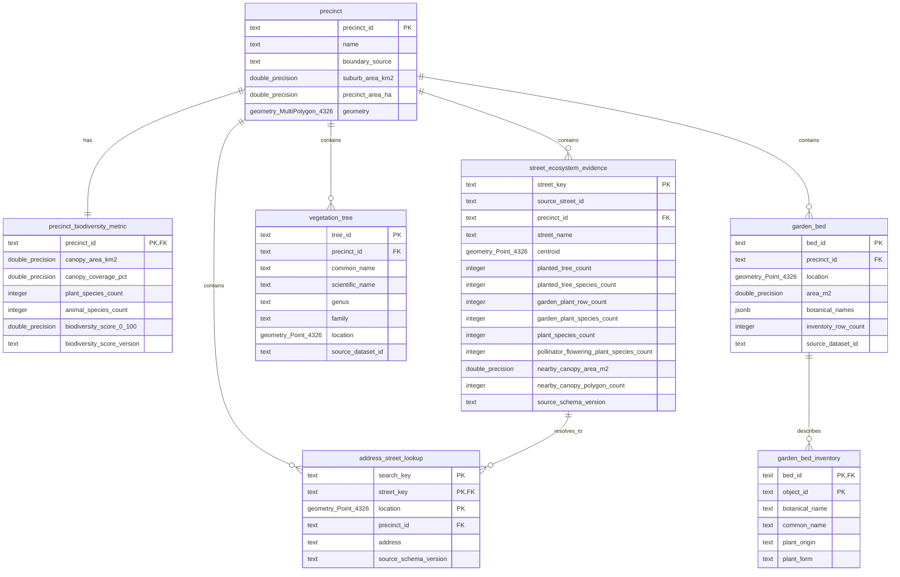

# Habitune precinct and street-evidence database model

Each precinct has exactly one current Iteration 1 metric record. `precinct.precinct_id` is the stable join key from the Dataset contract; the same value is both the metric table's primary key and its foreign key. Geometry comes from `Dataset/processed/map_view1_suburbs.geojson` and is normalized from source `Polygon` or `MultiPolygon` to PostGIS `MultiPolygon` with WGS84 SRID 4326. All other precinct and metric values come from `Dataset/processed/map_view1.json`; the ingestion layer does not reproduce Dataset calculations.

Iteration 2 imports `address_lookup.csv` and `street_level.json` without recalculating their values. Coordinate resolution first finds the containing precinct and then the nearest supported address point within the Dataset's documented 250 metre limit. The address points join to `street_ecosystem_evidence` through the globally unique Dataset `street_key` (`suburb|source street_id`). Source street IDs are retained separately because they are not globally unique across precincts.

The street table contains vegetation and nearby-canopy evidence only. It intentionally has no habitat-quality, connectivity, corridor, or gap classification.

The vegetation tables import the spatially filtered City of Melbourne outputs without
recalculating their values. Trees and garden assets are stored as PostGIS WGS84 Points.
The Garden source does not provide bed polygons; `area_m2` remains a measured attribute.
Plant/condition observations are kept in `garden_bed_inventory` so the one-row-per-asset
API table does not discard the source's multiple species rows.
