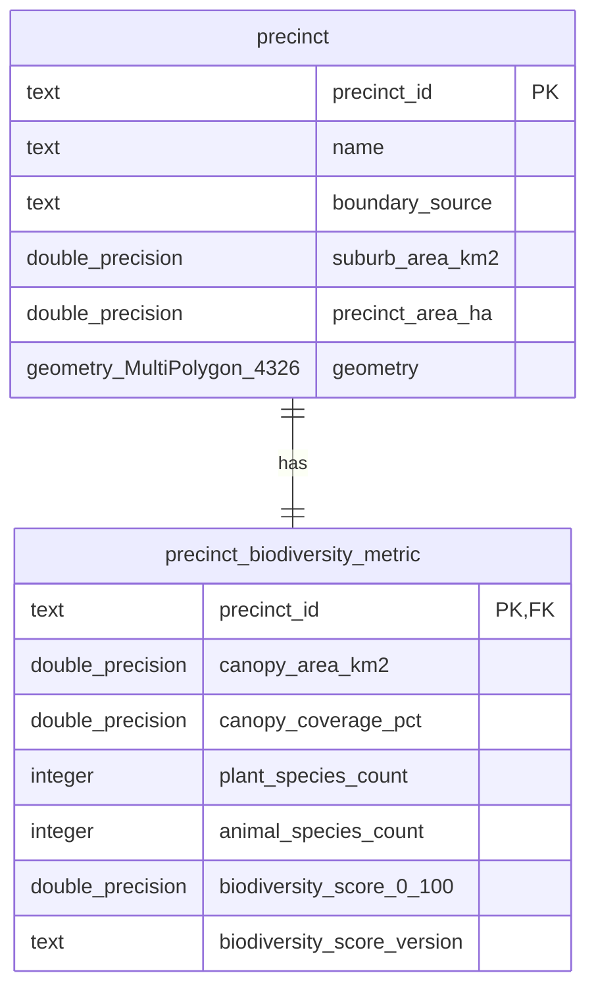

# Iteration 1 database model

Each precinct has exactly one current Iteration 1 metric record. `precinct.precinct_id` is the stable join key from the Dataset contract; the same value is both the metric table's primary key and its foreign key. Geometry comes from `Dataset/processed/map_view1_suburbs.geojson` and is normalized from source `Polygon` or `MultiPolygon` to PostGIS `MultiPolygon` with WGS84 SRID 4326. All other precinct and metric values come from `Dataset/processed/map_view1.json`; the ingestion layer does not reproduce Dataset calculations.

Street/address records, taxon details, observations, pollinator/bird details, and historical releases are deferred because the three Iteration 1 precinct endpoints only need the current precinct summaries and polygons. Their processed files remain pipeline artifacts until an endpoint has a documented need for them.
